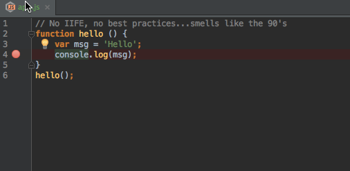

# Browser Debugging from PyCharm

We've seen browserless debugging in Node. Later we'll see using a fake
DOM, to keep browserless a little longer. But sometimes you really do
need to run in a browser. Sure is a shame that you have to lose
PyCharm as a debugging environment.

But you don't! In this section we show the JetBrains IDE Support
extension for Chrome. With it you can debug JavaScript, from PyCharm,
but which is running in Chrome.

# Overview

- Setup the JetBrains IDE Support extension for Chrome

- Start a debug session that uses it

# About the Chrome Extension

When working with HTML and JavaScript from your IDE, you really want
to avoid switching to a browser and hitting reload, then looking for
print output in the console. JetBrains
[provides a Chrome extension](https://www.jetbrains.com/webstorm/help/using-jetbrains-chrome-extension.html)
which lets PyCharm remote-control the Chrome browser, under IDE
control.

This applies to live editing HTML: you make some changes and the browser
updates, which we also saw in 
[Browser Bundling with Webpack](../webpack/webpack.md). It also applies to
JavaScript: you can run a debug session, where the interpreter is in
Chrome, but you stay in the IDE for all of your debugging.

# Installation

The page above provides more detail, but in summary, you first install
the Chrome extension 
[from the Google App Store](https://chrome.google.com/webstore/detail/jetbrains-ide-support/hmhgeddbohgjknpmjagkdomcpobmllji)
You can also just start a debug session and you will get prompted to install,
but doing it manually is more explicit.

# Start Debugging

Imagine we have an HTML file:

[include](../../../src/chrome_debugging/index.html)

...which loads some JavaScript:

[include](../../../src/chrome_debugging/app.js)
.. literalinclude:: app.js
    :language: js
    :caption: Chrome Debugging app.js

We'd like to jump into debugging when the browser gets to the `console.log`
line. We could always put the `debugger` keyword there, or use the Chrome
debugger. But we'd like to stay in our IDE and not context-switch.

It's surprisingly simple. First, in your `app.js`, click in the left gutter
to set a breakpoint one the line you'd like to stop at:



Next, right-click on the tab for `index.html` and choose
`Debug 'index.html'` from the context-menu. Your Chrome browser will open
in the background with a notice saying:

```
"JetBrains IDE Support" is debugging this browser
```

From your perspective, though, the IDE is still focused and you are in the
debugger:

https://www.youtube.com/watch?v=d1RZcOiQfPM

> #### info::Note
>
> You can't have the Chrome dev tools window open for the tab that
> is being used by the JetBrains IDE Support plugin. You will get
> a friendly warning telling you to close the tools.

# Wrapup

While not as seamless as full, browserless TDD, this is still a big step
up from the traditional reload cycle. You stay "in context", in your IDE,
and use the tools and techniques you've already mastered.