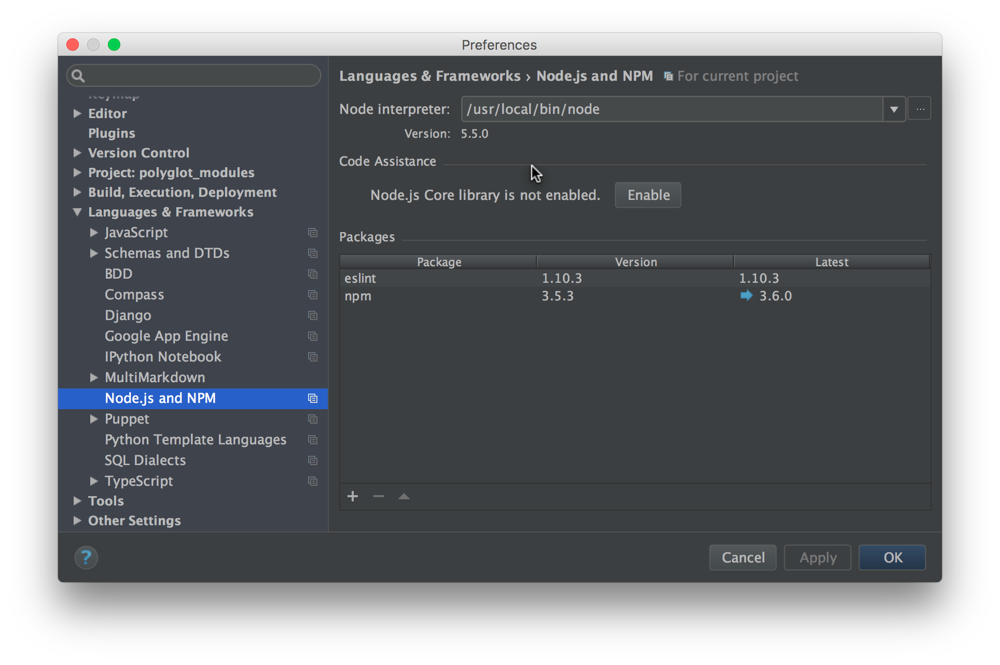
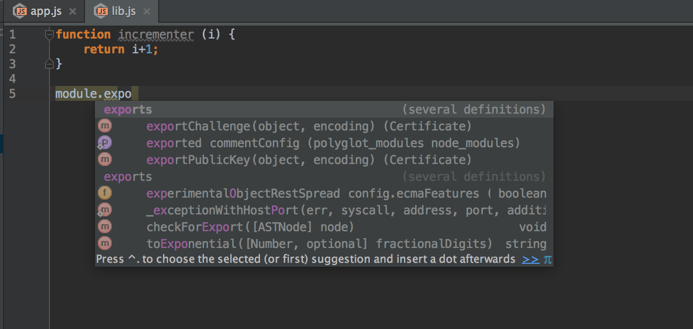

# Modules with CommonJS

Not all code is in one file. You might have a Python application that
includes code from Flask. Or, you might split your large Python code
into multiple Python modules, each in a separate file, and use Python
imports to include them in other modules.

In this section we look at one popular way to modularize your frontend
code, based on the Node's CommonJS specification.

## Overview

- Modularize our JavaScript application into two files

- Import code from one file, into the other

- See how PyCharm helps on this

## Background

Python has had modules for..well, if not forever, then a long time. The
earliest available documentation, for Python 1.4 in 1996, explains
[modules and imports](https://docs.python.org/release/1.4/tut/node41.html#SECTION00700000000000000000).
Later came packages, eggs, wheels, and lots more.

JavaScript historically has had none of this. If you have a function
`incrementer` in a file `lib.js`, and you wanted to use
`incrementer` in a file `app.js`, you would do something like:

```html
<script src="lib.js"></script>
<script src="app.js"></script>
```

That is, you'd tell your browser to load the first file, then the
second file, and you'd hope it all worked out. The browser would jam
everything into a global namespace, spawning a litany of
[obscure workarounds](https://en.wikipedia.org/wiki/Immediately-invoked_function_expression).
Since everything is async, you can't be sure `lib.js` is loaded
before your `app.js` code is executed, spawning another litany of
[more obscure workarounds](https://learn.jquery.com/using-jquery-core/document-ready/).

Server-side JavaScript via Node.js gained popularity, and Node added
its own module export/import system to JavaScript. As explained in
[JavaScript Modules: A Beginner’s Guide](https://medium.freecodecamp.com/javascript-modules-a-beginner-s-guide-783f7d7a5fcc),
this "specification", known as "CommonJS", works great on a Node.js,
which has a module loader, as well as fast I/O. Browsers have no
module loader and wildly-unpredictable I/O, and thus require
*bundlers* (the topic of the next article.)

Let's get started writing modular JavaScript code.

## Python Modules for Incrementer

Let's say we want a function `incrementer` which can be re-used in
multiple files. It takes a number and returns that number, incremented.

If this was Python, well, this really couldn't be much easier. Our
`lib.py`:

[include](../../../src/modules/lib.py)

This `incrementer` function is then imported into `app.py`:

[include](../../../src/modules/app.py)

Of course there could be some rough edges. If I import from a
different directory, I'll need a `__init__.py` file to make
this directory a package. If I want to use relative imports,
I can't directly invoke `app.py`. But it's clear that modules
and imports are a first class part of Python.

## Node.js Modules for Incrementer

Let's take a look at this in JavaScript for Node. Our `lib.js`
defines the function, and importantly, attaches it to the Node.js
global `module.exports`:

[include](../../../src/modules/lib.js)

In a nutshell, CommonJS "exports" definitions, available for
import from other files, via a `module.exports` built-in variable.
There are lots of semantics we are skipping over: named versus
default exports, dynamic exports, and more. This example shows a
default export.

Our application can now import this:

[include](../../../src/modules/app.js)

Our application imports our function from `./lib`. Two important points:

- The `./` in front tells Node to get this not from a pacakge in
  `node_modules` but instead, from a file in the local directory

- We left `.js` off the end of the filename...Node support either

As we saw in our [NodeJS introduction](../../../src/hello_node/hello_node.js), 
we can run `app.js` from the command line or from PyCharm:

https://www.youtube.com/watch?v=qscLx2mLtzo

## PyCharm and Modules

PyCharm understands Node.js import syntax, but you have to help it a
little bit. In PyCharm Preferences, go to Languages & Frameworks ->
Node.js and NPM. Under `Code Insight`, click the "Enable" button
beside `Node.js Core library is not enabled`:



This will, for example, fix the warning about `module` being
undefined. With the Node.js library enabled, not only is `module`
defined, but it can be code-completed:



Enable the library also let PyCharm help us on import mistakes. For
example, with the Node.js core *disabled*, PyCharm doesn't spot
import failures from bad filenames. But with it enabled, a warning
is correctly presented:

https://www.youtube.com/watch?v=h7nbfvNf-VM

## Wrapup

It's odd in a way to say it, but this article is a big step in the
process towards Polyglot Python with PyCharm. It comes with many
caveats:

- *We just broke the browser*. The code runs in Node.js but won't
  work in browser-based JavaScript engines. We'll fix that in
  [webpack](../webpack/webpack.md).

- *Older module system*. Some frontend developers are adopting
  ES2015 (aka ES6) modules. Teaching that, however, requires teaching
  the Babel transpiler, as Node.js doesn't natively support ES2015
  modules (because Chrome v8 doesn't support it, because the spec is
  still in progress.)

With that said, this is still a big step towards developing Pythonically.
We can work in isolation, with some of our code disassociated from a
browser, and perhaps...dare we dream...start on test-driven development
(TDD).
