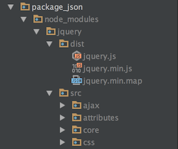
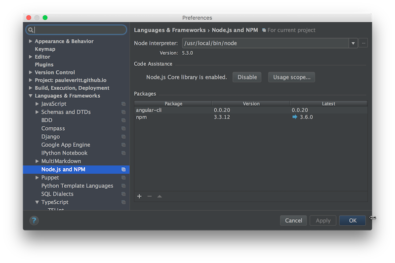

# JavaScript Packaging with `package.json`

Python has infrastructure for installing libraries with dependencies.
The frontend world does as well, based on [npm](https://npmjs.org/).

In this article we will turn a directory into a project by creating a
`package.json` file. We will then use this to hold dependency
information as we install packages needed both for the running of our
frontend and tooling packages needed in the building of the frontend.

## Overview

- Learn about frontend tooling using the NodeJS universe

- Show the convenient way to get all dependencies

- Discuss reproducible builds

## Installing Dependencies: The Shootout

Python can install packages. Python can track dependencies. Python can
do both, and as we who love Python know, it's one of the darkest corners
of Python history. setuptools, distutils, easy_install, setup.py,
MANIFEST.in, setup.cfg, pip, requirements.txt, eggs, wheels...it's been
a rocky road for Python to get to an emerging point of consistency.

Let's concentrate on making a directory into a "project". In Python,
you would create a `setup.py` file with the `setuptools`-compliant
data, such as the name of the project. You would also supply some
dependencies, although many people also do that in pip's
`requirements.txt` file. Finally, you would make a virtual
environment, which would install your dependencies into a
`site-packages` directory under, for example, `lib/python3.5`.

Let's tackle each part of this, using the new NodeJS/npm toolchain.

## Making a Project

In Python, if you want a directory to be a "project", you create a
`setup.py` file. This contains, for example, the name of the project.

In the world of Node, a 
[package.json](https://docs.npmjs.com/files/package.json)
file performs this role.
Since it is JSON and not JavaScript, it can only hold configuration data.

You interact with this file primarily through the `npm` command and
toolchain. For example, you can let `npm` ask you question to create a
new `package.json` file:

```bash
    $ npm init
```

If you're in a hurry, tell it to accept the defaults for every question:

```bash
    $ npm init --yes
```

You now have a project area. You can check this `package.json` file into
version control.

## Install Dependencies

You have a frontend that depends on jQuery and a backend that depends on
Flask. You want to easily install those packages, but you also want
to record them as dependencies, so you can reproduce your setup later.

In Python, you might do any of the following:

- Install the package using `pip`, then either use `pip freeze` or
  manually edit a `requirements.txt` file to record the dependency

- Edit the dependencies list in `setup.py` then execute `python
  ./setup.py install`

- Use PyCharm's visual package installer, then record the fact later

In Python, installing a package and recording a dependency are distinct.
For this task, using `npm` is a breath of fresh air:

```bash
    $ npm install --save jquery
```

This command says to download the jQuery package, install it *local* to
the project, and record it as a dependency in `package.json`. Instead
of `lib/python3.5/site-packages`, though, packages are installed
in a `node_modules` subdirectory under the location of
`package.json`.



There's a lot to talk about for 
[npm install](https://docs.npmjs.com/cli/install). 
Just a few points for this
article:

- You can pass a flag to install packages globally

- You can save packages as a project dependency or a development
  dependency

- You can record dependency version ranges in rich ways, based on
  semantic versioning or channels

.. note::

    One reason `npm` has gotten so big, so powerful, so quickly: it's
    a company. In 2014 and 2015 it raised $10M in funding. For
    better or worse.

## PyCharm's Friendly Face

For Python, we know that 
[PyCharm provides a UI](https://www.jetbrains.com/pycharm/help/installing-uninstalling-and-upgrading-packages.html)
for finding and adding packages, removing them, etc. The same is true for
`npm` packages: PyCharm 
[provides an npm UI](https://www.jetbrains.com/pycharm/help/node-js-and-npm.html)
for these as well:



You can reach this UI at Preferences -> Node.js and NPM. With this, you
don't have to use the command line and learn the `npm` interface for
installing, updating, and removing `npm` packages into `node_modules`.

## Virtual Environment?

We now have our dependency (jQuery) as a file in our project area,
recorded as a dependency with a minimum version. At the top in
the shootout, we said we would also show having a virtual
environment for isolating our software. For Node and npm, this
last step is...nothing.

Node packaging was designed to have a two-tier namespace for finding
packages: either local to the project, in a `node_modules`
subdirectory, or global to the interpreter. The former is checked
first. We only inherit packages from the global environment if
we accidentally install them with `npm install -g`.

If you do want that level of isolation, which is the default in
the latest `virtualenv` and `pyvenv` commands, you can use
[nvm](https://github.com/creationix/nvm)
to manage your Node
interpreters.

## Wrapup

With `package.json`, we have a way to make a project area,
record package information, install packages, and record dependencies.
This gives us most of what we need for reproducible builds.
